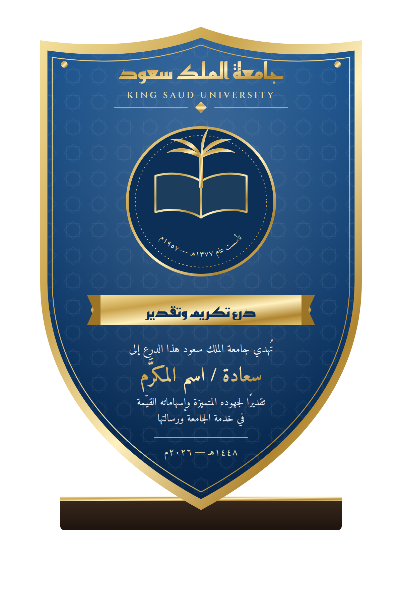

# درع جامعة الملك سعود

تصميم درع تكريم بهوية جامعة الملك سعود (الأزرق الملكي مع الذهبي، وزخرفة النجمة الثمانية الإسلامية).

## الملفات
- `shield.svg` — التصميم الأصلي (متجهي، قابل للتكبير دون فقدان الجودة، والخطوط مضمّنة داخله).
- `preview.png` — معاينة بدقة عالية.

## التعديل
افتح `shield.svg` بأي محرر نصوص أو في Illustrator / Inkscape وعدّل:
- اسم المكرَّم: العنصر `id="recipient"`.
- التاريخ: العنصر `id="date"`.
- نص الإهداء: الأسطر أعلى وأسفل اسم المكرَّم.

## ملاحظات للطباعة
- الشعار في المنتصف (كتاب ونخلة) رمز تعبيري؛ يُستبدل بالشعار الرسمي المعتمد من الجامعة داخل المجموعة `id="emblem"` قبل الإنتاج.
- يُنصح بتحويل النصوص إلى مسارات (Outlines) قبل الإرسال للمطبعة.
- مقترح الخامات: كريستال أو أكريليك أزرق مع حفر ذهبي، على قاعدة خشبية داكنة.
- الخطوط: Amiri و Reem Kufi و Cinzel (رخصة SIL المفتوحة).
